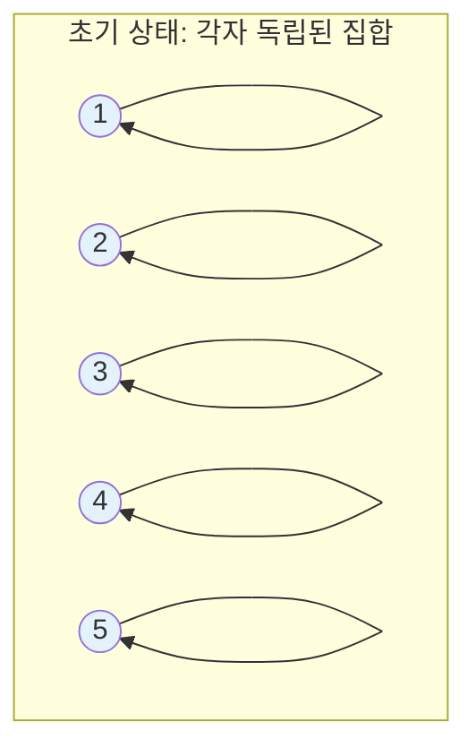
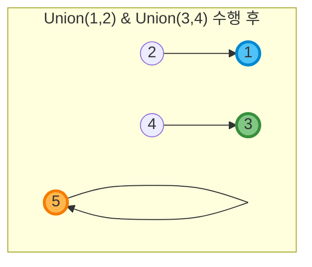
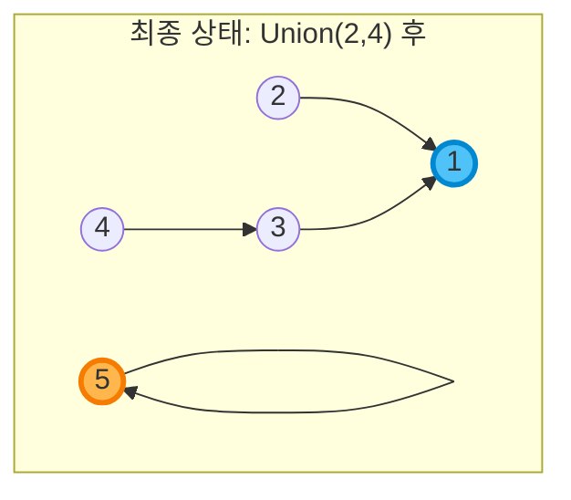
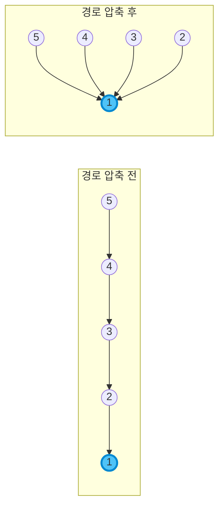
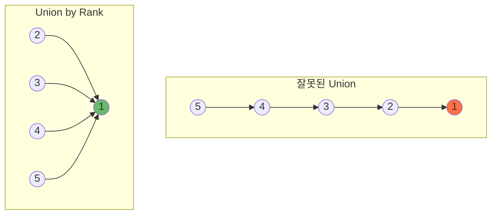
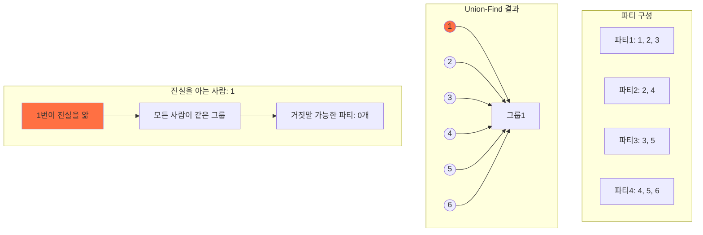

# Union-Find (Disjoint Set) 자료구조 완벽 가이드 🎯

## 📌 개념 소개

Union-Find는 **서로소 집합(Disjoint Set)**을 표현하는 자료구조입니다. 원소들의 그룹을 관리하고, 두 원소가 같은 그룹에 속하는지 빠르게 확인할 수 있습니다.

### 주요 연산
1. **Find**: 특정 원소가 속한 그룹의 대표값(루트) 찾기
2. **Union**: 두 그룹을 하나로 합치기

## 🔍 작동 원리

### 1. 초기 상태
각 원소는 자기 자신을 부모로 가집니다.



### 2. Union 연산
Union(1, 2)와 Union(3, 4)를 수행한 후:



### 3. 최종 트리 구조
Union(2, 4)를 추가로 수행하면:



## 💻 구현 코드

### 기본 구현

```python
class UnionFind:
    def __init__(self, n):
        # 부모 노드를 저장하는 배열 (처음에는 자기 자신이 부모)
        self.parent = list(range(n))
        # 각 트리의 높이를 저장 (Union by Rank 최적화용)
        self.rank = [0] * n
    
    def find(self, x):
        # 경로 압축 최적화
        if self.parent[x] != x:
            self.parent[x] = self.find(self.parent[x])
        return self.parent[x]
    
    def union(self, x, y):
        # 두 원소의 루트를 찾음
        root_x = self.find(x)
        root_y = self.find(y)
        
        # 이미 같은 집합이면 종료
        if root_x == root_y:
            return
        
        # Union by Rank: 높이가 낮은 트리를 높은 트리에 연결
        if self.rank[root_x] < self.rank[root_y]:
            self.parent[root_x] = root_y
        elif self.rank[root_x] > self.rank[root_y]:
            self.parent[root_y] = root_x
        else:
            self.parent[root_y] = root_x
            self.rank[root_x] += 1
    
    def is_same_set(self, x, y):
        return self.find(x) == self.find(y)
```

## 🚀 최적화 기법

### 1. 경로 압축 (Path Compression)
Find 연산 시 거쳐간 모든 노드를 루트에 직접 연결합니다.



### 2. Union by Rank
항상 높이가 낮은 트리를 높은 트리에 연결하여 트리의 높이를 최소화합니다.



## 📊 시간 복잡도

| 연산 | 시간 복잡도 |
|------|------------|
| Find | O(α(n)) ≈ O(1) |
| Union | O(α(n)) ≈ O(1) |
| 초기화 | O(n) |

> α(n)은 애커만 함수의 역함수로, 실질적으로 상수입니다.

## 🎯 백준 1043번에서의 활용

```python
# 1043번 거짓말 문제 적용 예시
def solve_1043():
    n, m = map(int, input().split())
    
    # Union-Find 초기화
    uf = UnionFind(n + 1)  # 사람 번호가 1부터 시작
    
    # 진실을 아는 사람들 입력
    truth_data = list(map(int, input().split()))
    truth_count = truth_data[0]
    truth_people = truth_data[1:] if truth_count > 0 else []
    
    # 각 파티 정보 저장
    parties = []
    for _ in range(m):
        party_data = list(map(int, input().split()))
        party_size = party_data[0]
        party_people = party_data[1:]
        parties.append(party_people)
        
        # 같은 파티 참석자들을 union
        for i in range(1, party_size):
            uf.union(party_people[0], party_people[i])
    
    # 진실을 아는 사람과 연결된 모든 사람 찾기
    truth_roots = set()
    for person in truth_people:
        truth_roots.add(uf.find(person))
    
    # 거짓말 가능한 파티 수 계산
    lie_count = 0
    for party in parties:
        can_lie = True
        for person in party:
            if uf.find(person) in truth_roots:
                can_lie = False
                break
        if can_lie:
            lie_count += 1
    
    return lie_count
```

## 🎨 시각적 예시: 1043번 문제



## 📚 활용 분야

1. **네트워크 연결성 확인**
2. **최소 신장 트리 (Kruskal 알고리즘)**
3. **사이클 탐지**
4. **동적 연결성 문제**
5. **이미지 분할 (Image Segmentation)**

## 💡 핵심 정리

- Union-Find는 **그룹 관리**에 최적화된 자료구조
- **경로 압축**과 **Union by Rank**로 거의 O(1) 시간복잡도 달성
- 백준 1043번처럼 **정보 전파** 문제에 적합
- 구현이 간단하면서도 강력한 성능

---

> 🎯 **Tip**: Union-Find 문제를 만나면 "같은 그룹인지 확인해야 하는가?"를 생각해보세요! 