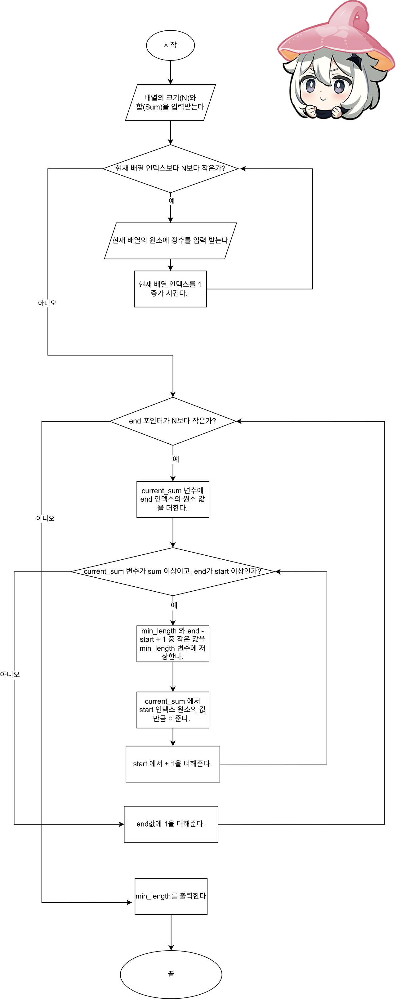

## 문제

10,000 이하의 자연수로 이루어진 길이 N짜리 수열이 주어진다. 이 수열에서 연속된 수들의 부분합 중에 그 합이 S 이상이 되는 것 중, 가장 짧은 것의 길이를 구하는 프로그램을 작성하시오.

## 입력

첫째 줄에 N (10 ≤ N < 100,000)과 S (0 < S ≤ 100,000,000)가 주어진다. 둘째 줄에는 수열이 주어진다. 수열의 각 원소는 공백으로 구분되어져 있으며, 10,000이하의 자연수이다.

## 출력

첫째 줄에 구하고자 하는 최소의 길이를 출력한다. 만일 그러한 합을 만드는 것이 불가능하다면 0을 출력하면 된다.

## 정답 코드

```
#include <stdio.h>
#include <limits.h> // INT_MAX 를 사용하기 위해 포함


#define MAX_N 100001

int min(int a, int b) {
    return a < b ? a : b;
}

int main()
{
    int N;
    long long Sum; 
    int array[MAX_N]; 

    if (scanf("%d %lld", &N, &Sum) != 2) {
        fprintf(stderr, "N과 Sum 입력 오류!\n");
        return 1;
    }

     if (N <= 0 || N >= MAX_N) {
         fprintf(stderr, "N 값이 유효 범위를 벗어났습니다 (1 ~ %d).\n", MAX_N - 1);
         return 1;
     }


    for (int i = 0; i < N; i++) {
        if (scanf("%d", &array[i]) != 1) {
             fprintf(stderr, "배열 원소 입력 오류 (인덱스 %d)!\n", i);
             return 1;
        }
    }

    int start = 0;
    int end = 0;
    long long current_sum = 0;
    int min_length = INT_MAX;

    while (end < N) {

        current_sum += array[end];

        while (current_sum >= Sum && start <= end) {
            min_length = min(min_length, end - start + 1);

            current_sum -= array[start];
            start++;
        }

        end++;
    }

    if (min_length == INT_MAX) {
        printf("0\n");
    } else {
        printf("%d\n", min_length);
    }
    return 0;
}
```

## 풀이

### limits.h

```
#include <limits.h>
```

```
int min_length = INT_MAX;
```

  
INT\_MAX 를 사용하기 위해 limits.h 의 라이브러리를 포함시킨다.

참고로 INT\_MAX의 값은 2,147,483,647 이다.

### 삼항연산자

```
int min(int a, int b) {
    return a < b ? a : b;
}
```

? 앞에 있는 조건이 true 이면 a 를 반환하고, false이면 b를 반환한다. 

### scanf 반환값

```
if (scanf("%d %lld", &N, &Sum) != 2) {
        fprintf(stderr, "N과 Sum 입력 오류!\n");
        return 1;
    }
```

참고로 scanf는 정상적으로 입력 받은 정수의 갯수의 값을 반환한다. 

### 투 포인터 알고리즘

start 와 end 포인터는 한 방향으로만 움직인다. (처음부터 끝까지)

모든 배열을 처음부터 끝까지 확인하는게 아니므로 훨씬 빠르게 조건에 맞는 값을 찾을 수 있다. 

### 부분합 순서도

\*아래의 순서도는 예외처리 과정은 제외 하였음 





### 예외처리

```
if (min_length == INT_MAX) {
        printf("0\n");
    } else {
        printf("%d\n", min_length);
    }
```

만약 프로그램을 다 실행시켰는데도 min\_length의 값이, INT\_MAX와 같다면, 

```
 while (current_sum >= Sum && start <= end) {
            min_length = min(min_length, end - start + 1);

            current_sum -= array[start];
            start++;
        }
```

이 반복문이 한번도 실행이 안되었다는 뜻이므로, 0을 출력시킨다. 

예를 들어,

N = 5 , Sum = 15

배열원소 1 2 3 4 1

일 경우는 0을 출력 시킨다.