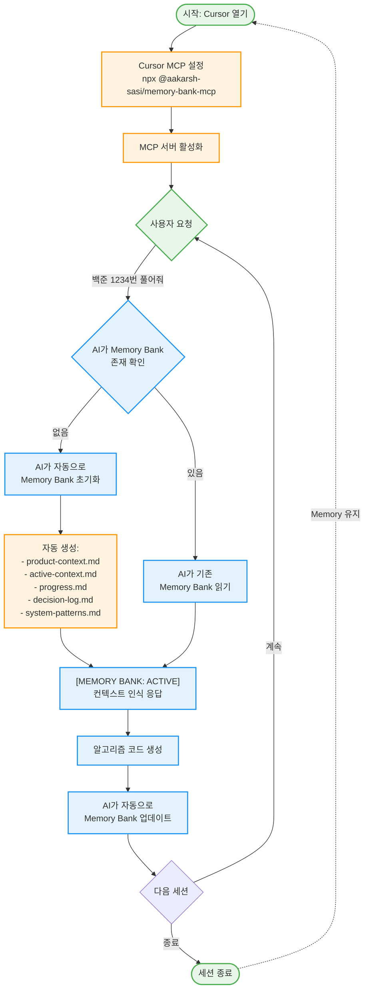

# Memory Bank MCP 작동원리 🧠

## 기본 개념

Memory Bank MCP는 AI가 프로젝트의 "기억"을 유지하도록 돕는 도구입니다.
노트에 중요한 내용을 적어두는 것처럼, AI도 프로젝트 정보를 파일로 저장합니다.

## 전체 플로우 차트



## 알고리즘 스터디에서 Memory Bank MCP 사용하기 🎯

### 1. 초기 설정 (한 번만 수행)

1. **Cursor 설정 열기**
   - Settings (⚙️) → Extensions → Model Context Protocol

2. **MCP 서버 추가**
   
   ```text
   Name: Memory Bank MCP
   Command: npx
   Arguments: @aakarsh-sasi/memory-bank-mcp --mode code --folder my-algorithm-memory
   ```

3. **서버 활성화**
   - 토글 스위치를 켜서 활성화

### 2. 실제 사용 시나리오 📝

#### 시나리오 1: 첫 문제 풀이

```python
# 사용자: "백준 1463번 1로 만들기 문제 풀어줘"
# AI 응답: "[MEMORY BANK: ACTIVE] 새로운 Memory Bank를 초기화하고 있습니다..."

# AI가 자동으로 생성하는 것들:
# - my-algorithm-memory/product-context.md: "Python 알고리즘 스터디"
# - my-algorithm-memory/active-context.md: "현재 풀이 중: 1463번"
# - my-algorithm-memory/progress.md: "2024-01-20: 1463번 시작"
```

#### 시나리오 2: 유사 문제 풀이

```python
# 사용자: "비슷한 DP 문제 더 풀어줘"
# AI 응답: "[MEMORY BANK: ACTIVE] 이전에 1463번에서 사용한 DP 패턴을 참고하겠습니다..."

# AI가 기억하는 것들:
# - 이전에 사용한 DP 접근법
# - 시간/공간 복잡도 최적화 방법
# - 실수했던 부분들
```

#### 시나리오 3: 복습 및 패턴 학습

```python
# 사용자: "지금까지 푼 DP 문제들 정리해줘"
# AI 응답: "[MEMORY BANK: ACTIVE] progress.md와 decision-log.md를 확인해보니..."

# AI가 제공하는 것들:
# - 풀었던 문제 목록
# - 각 문제의 핵심 아이디어
# - 공통 패턴 분석
```

### 3. Memory Bank 파일 구조 이해하기 📂

```text
my-algorithm-memory/
├── product-context.md      # 프로젝트 정보
│   └── "Python 알고리즘 스터디, 백준/프로그래머스 문제 풀이"
├── active-context.md       # 현재 상태
│   └── "현재 풀이 중: 그래프 탐색 문제들"
├── progress.md            # 진행 기록
│   ├── "2024-01-20: 1463번 DP로 해결"
│   └── "2024-01-21: 2606번 BFS로 해결"
├── decision-log.md        # 중요 결정
│   └── "DFS vs BFS 선택 이유, 시간복잡도 분석"
└── system-patterns.md     # 코드 패턴
    └── "자주 사용하는 DP 템플릿, 그래프 탐색 템플릿"
```

### 4. 활용 팁 💡

#### 문제 풀이 시작할 때

```text
"백준 [문제번호]번 문제 풀어줘"
→ AI가 자동으로 Memory Bank 확인 및 업데이트
```

#### 특정 패턴 학습할 때

```text
"지금까지 푼 이분탐색 문제들의 패턴 분석해줘"
→ AI가 Memory Bank에서 관련 정보 검색
```

#### 실수 방지하기

```text
"이전에 비슷한 문제에서 실수한 적 있나?"
→ AI가 decision-log.md에서 관련 기록 확인
```

### 5. 주의사항 ⚠️

1. **Memory Bank 폴더는 git에서 제외됨**
   - `.gitignore`에 자동 추가
   - 개인 학습 기록은 로컬에만 저장

2. **AI 응답 상태 확인**
   - `[MEMORY BANK: ACTIVE]`: 정상 작동
   - `[MEMORY BANK: INACTIVE]`: 설정 확인 필요

3. **주기적인 정리**
   - 오래된 active-context.md는 가끔 정리
   - progress.md는 학습 기록으로 보관

### 6. 고급 활용법 🚀

#### 학습 통계 확인

```text
"이번 달에 푼 문제 수와 유형별 분포 보여줘"
→ AI가 progress.md 분석하여 통계 제공
```

#### 취약점 분석

```text
"내가 자주 틀리는 문제 유형이 뭐야?"
→ AI가 decision-log.md에서 패턴 분석
```

#### 면접 대비

```text
"지금까지 푼 문제 중 면접에 나올만한 것들 정리해줘"
→ AI가 전체 Memory Bank 분석하여 핵심 문제 추출
```

이렇게 Memory Bank MCP를 활용하면 AI가 여러분의 알고리즘 학습 과정을 기억하고, 
점진적으로 더 나은 도움을 제공할 수 있습니다! 🎯