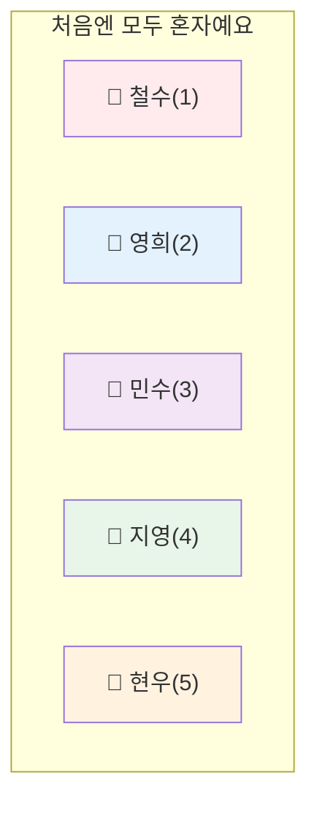
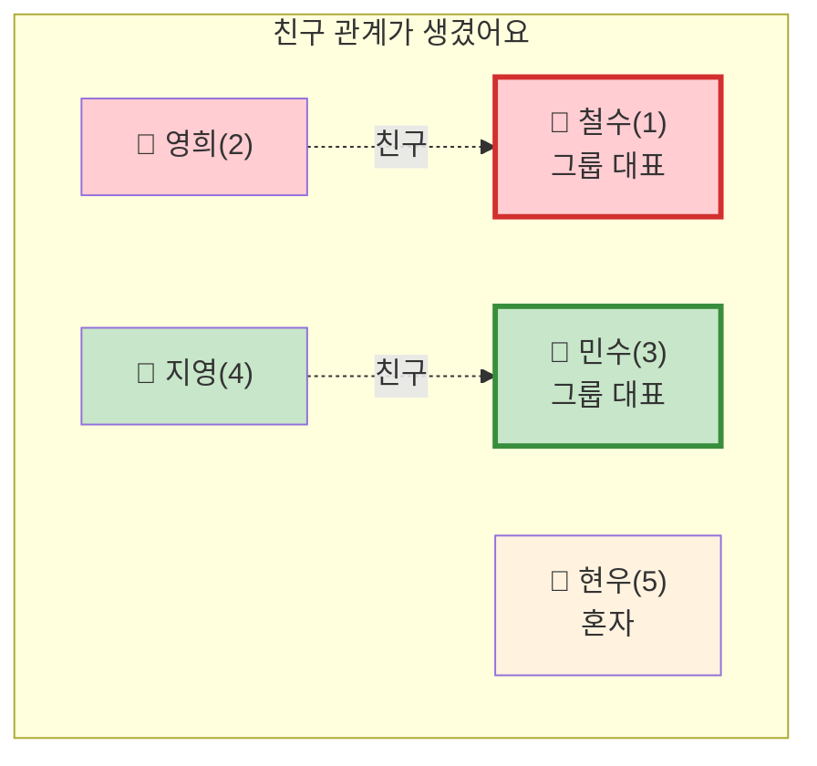
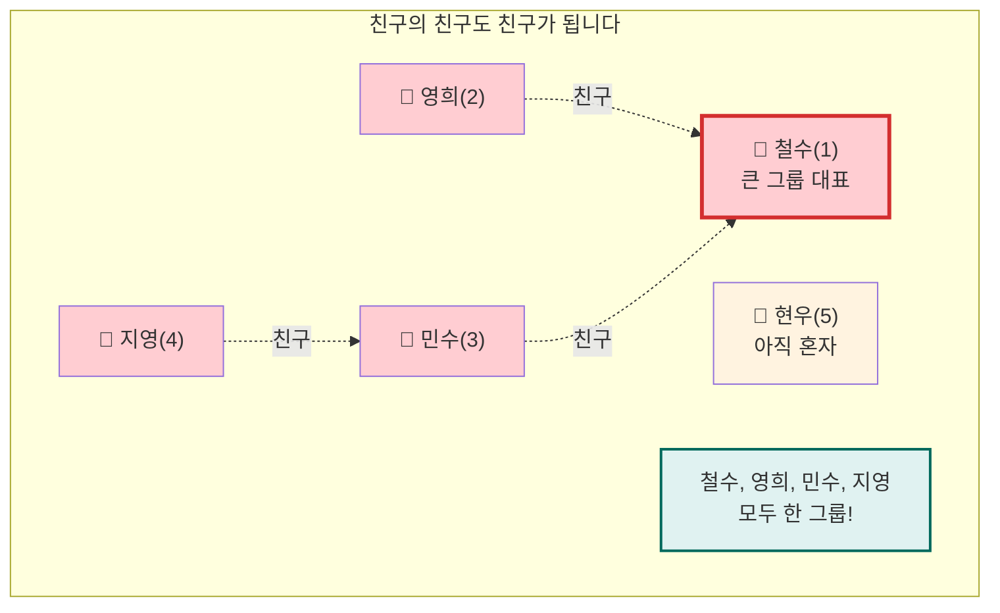
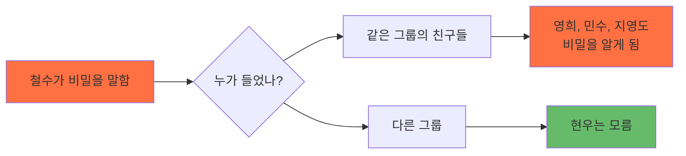
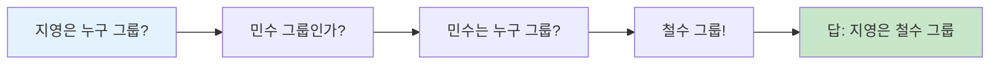
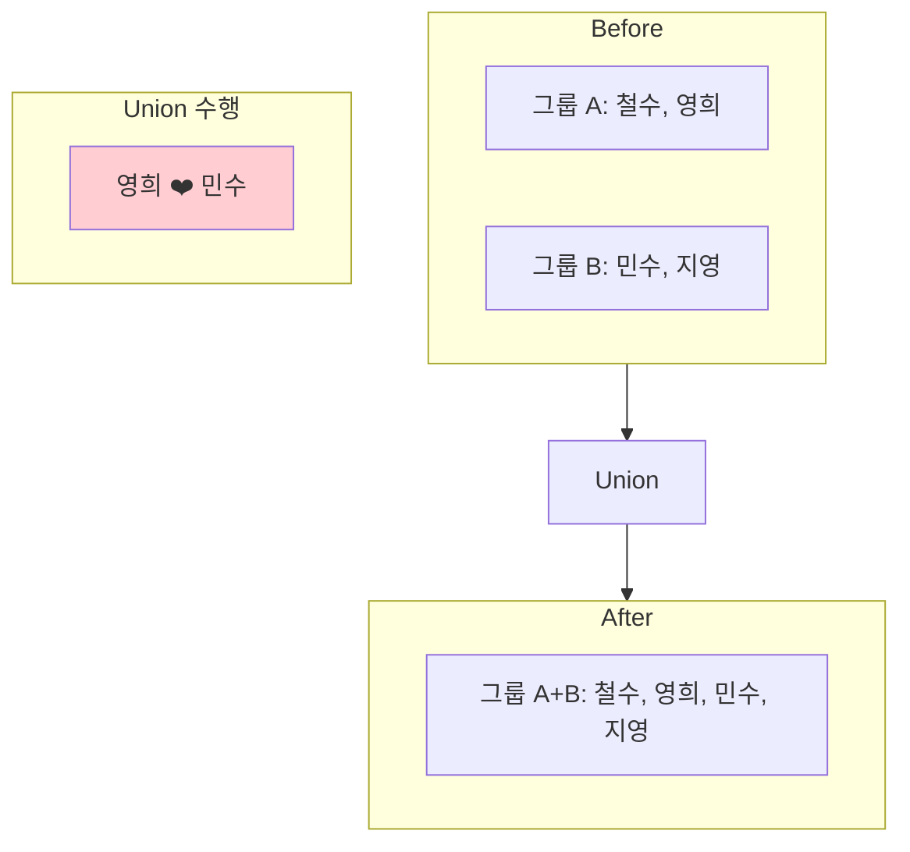
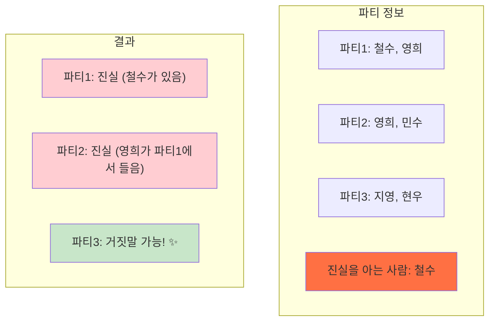
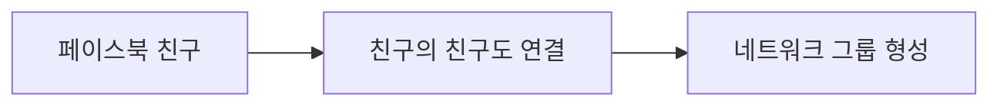
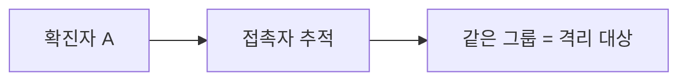
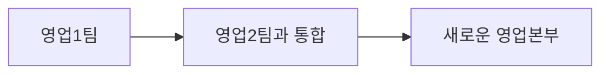

# 친구 그룹으로 이해하는 Union-Find 🤝

## 🎯 이게 뭔가요?

Union-Find를 한 마디로 설명하면 **"누가 누구랑 친구인지 관리하는 방법"**입니다!

### 실생활 예시 🏫

학교에 5명의 학생이 있다고 상상해보세요:
- 철수(1번)
- 영희(2번)  
- 민수(3번)
- 지영(4번)
- 현우(5번)

처음엔 모두가 혼자입니다. 그런데...

## 📖 이야기로 배우는 Union-Find

### 1단계: 처음 상황 (모두 혼자)

### 2단계: 친구가 되었어요! (Union)

철수와 영희가 친구가 되었습니다! 그리고 민수와 지영도 친구가 되었어요.

### 3단계: 친구의 친구는 친구!

영희가 민수와도 친구가 되었어요. 그러면 어떻게 될까요?

## 🤔 왜 이게 필요한가요?

### 문제 상황: 비밀 이야기 🤫

철수가 "나 사실 외계인이야!"라는 비밀을 말했다고 해봅시다.

**Union-Find는 이렇게 "정보가 퍼지는 그룹"을 관리하는 데 완벽합니다!**

## 🎮 두 가지 기능만 기억하세요!

### 1. Find (찾기) - "너 누구 그룹이야?"

### 2. Union (합치기) - "우리 친구하자!"

## 🎯 백준 1043번 문제로 이해하기

### 상황 설정 🎉

지민이가 파티에서 거짓말(과장된 이야기)을 하고 싶어요!
- 진실: "나 시험에서 80점 받았어"
- 거짓말: "나 시험에서 100점 받았어!" 

### 문제의 규칙 📋

1. **진실을 아는 사람**이 있는 파티 → 진실만 말해야 함
2. **한 사람이 두 파티에서 다른 이야기를 들으면** → 거짓말쟁이로 들통남!

### 예시로 이해하기

## 💡 핵심 정리

1. **Union-Find = 친구 그룹 관리 시스템**
2. **Find = "너 어느 그룹이야?"**
3. **Union = "우리 이제 한 그룹이야!"**
4. **활용 = 정보가 퍼지는 것을 추적**

## 🎨 일상생활 활용 예시

### 1. 소셜 네트워크 👥

### 2. 전염병 추적 🏥

### 3. 회사 부서 통합 🏢

## 🚀 다음 단계

이제 Union-Find의 기본 개념을 이해하셨다면:
1. 간단한 문제부터 풀어보기
2. 코드로 구현해보기
3. 최적화 기법 배우기

## ❓ 자주 묻는 질문

**Q: 왜 트리 구조를 사용하나요?**
> A: 대표를 빨리 찾기 위해서예요! 계층 구조로 만들면 찾기가 쉬워집니다.

**Q: 실제로 어디에 쓰이나요?**
> A: SNS 친구 추천, 지도 앱의 경로 찾기, 이미지 편집 프로그램 등에서 사용됩니다!

**Q: 다른 자료구조와 뭐가 다른가요?**
> A: Union-Find는 "그룹 관리"에 특화되어 있어요. 매우 빠르게 그룹을 합치고 확인할 수 있습니다.

---

> 💡 **기억하세요**: Union-Find는 복잡해 보이지만, 결국 "**누가 누구와 연결되어 있는지**"를 관리하는 도구입니다! 