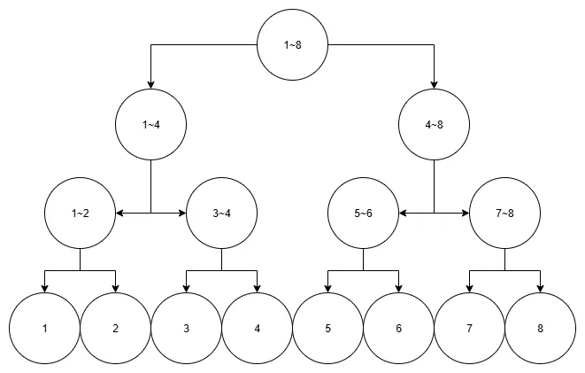

```cpp
#include <iostream>
#include <string>
using namespace std;

char v[700000];
int p;
inline int f(){
 int answer = 0, x = v[p++];
    bool flag = false;
    if(x == '-') flag = true;
    else answer = (x & 0x0F);
    
 while (1){
  x = v[p++];
  if (x == '\n' || x == ' ') break;
  answer = answer * 10 + (x & 0x0F);
 }
 return flag ? -answer : answer;
}
int main(void){
 cin.tie(0);
 ios::sync_with_stdio(0);

    fread(v, 1, 700000, stdin);
 int n = f(), arr[52769] = { 0 };
    string answer;
    
 for (int k = 1; k <= n; k++){
  for (int t = (f() + 42768); t; t >>= 1) arr[t]++;
  int idx = 1, dx = (k + 1) / 2;
  while (!(idx & (1 << 15))) arr[idx << 1] >= dx ? idx <<= 1 : (dx -= arr[idx << 1], idx = ((idx << 1) | 1));
  answer += to_string(idx - 42768); answer.push_back('\n');
 }
    cout << answer;
 return 0;
}
```

위 코드에서 f()함수는 입력을 숫자로 바꾸어 한개씩 되돌려 주는 함수입니다.

먼저 fread()함수를 stdin 대상으로 사용해 모든 입력을 한번에 읽어오고 그것을 v 배열에 저장합니다.

그 후 p 변수를 이용해 하나씩 증가시키며 각 문자를 조합해 숫자로 만듭니다.

읽은 문자가 **-** 일땐 음수를 붙여주고 아니면 양수로 인식합니다.

그리고 x가 개행문자가 나올때까지 읽고 읽은 숫자를 0x0F와 비트 AND 연산을 해 숫자로 바꾸고 answer에 저장합나다.

> 아스키코드로 0은 십진수로 48, 이진수로 0011 0000, 1은 0011 0001, 9는 0011 1001 따라서 0x0F, 즉 0000 1111과 AND 연산을 하면 하위 4비트만 남으므로 숫자로 변환 가능하다.

이 때 기존에 있던 answer 값은 10을 곱해 한자리 수를 올려줍니다.

그 후 이 코드에서는 arr을 세그먼트 트리를 활용한 방식으로 말한 숫자의 개수를 저장합니다.

arr에서 1 ~ 32768(2^15)은 그 범위에 있는 숫자 개수를 저장합니다.

나머지 32769 ~ 52768은 실제 값을 저장합니다.

자세히 설명하면 원래 세그먼트 트리는 아래와 같이 구성되고 리프노드가 아닌 노드에서는 각 범위의 합을 저장합니다.



하지만 이 문제에선 활용하여 각 범위에 존재하는 숫자의 개수를 저장합니다.

이걸 저장하는 코드가 `for (int t = (f() + 42768); t; t >>= 1) arr[t]++;`이고

찾는 코드가 그 아래 부분입니다.

찾는 방법은 중간값의 인덱스를 구한뒤 그 인덱스와 구간에 있는 숫자의 개수를 비교해나가며 찾는 방식입니다.

`arr[idx << 1]`은 현재 인덱스의 2배, 즉 왼쪽에 들어있는 원소의 개수가 중간값의 인덱스와 비교해 크면 왼쪽, 작으면 왼쪽만큼은 확인했고 나머지 구간을 확인해야하니 중간값의 인덱스에서 왼쪽 노드의 원소의 개수를 빼주고 오른쪽 노드로 이동합니다.

이 때 `idx = (idx<<1|1)`는 2를 곱한뒤 1을 더해주는 연산과 같습니다.
